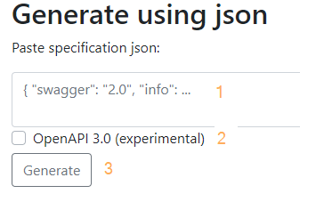

# Описание метода client_lib.jobs()

## Подготовка

1. С сайта [SBCloud API](https://api.aicloud.sbercloud.ru/redoc "Тык") выгружаем API в json-формате.
2. Открываем полученный файл в любом редакторе и удаляем методы, который не нужны на данный момент.

```bash
#!/bin/warning
Не удаляем json-схемы!
```

3. Переходим на сайт [www.swdoc.org](https://www.swdoc.org/ "Тык").

4. Последовательно выполняем:

.

- [1] - вставляем код из json-файла;
- [2] - ставим галочку;
- [3] - нажимаем ```Generate```.

5. Сохраняем скомпилированный файл в pdf-формате, который содержит описание метода client_lib.jobs().

## Конвертация в xml

Для конвертации pdf в xml можно использовать замечательный сервис - [PDFTables](https://pdftables.com/pdf-to-excel-api "Тык")

На выходе получаем структурированный xml-файл. В дальнейшем тэги надо декларировать, чтобы привязать к xsl-схеме и визуально оформить. Так же, можно заняться ручным переводом.

На самом деле, для автоматизации описания API, лучше использовать [AsciiDoc](http://asciidoc.org/manpage.html "Тык") и [swagger2markup](http://swagger2markup.github.io/swagger2markup/1.3.1/) с дополнительными плагинами.
